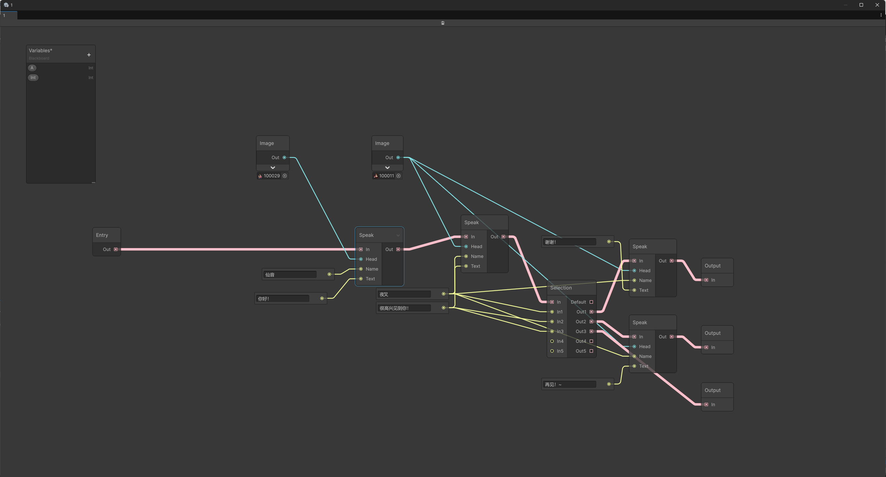
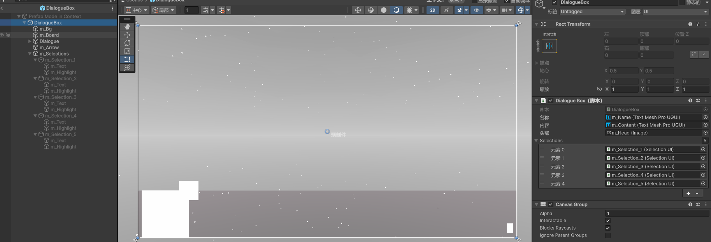
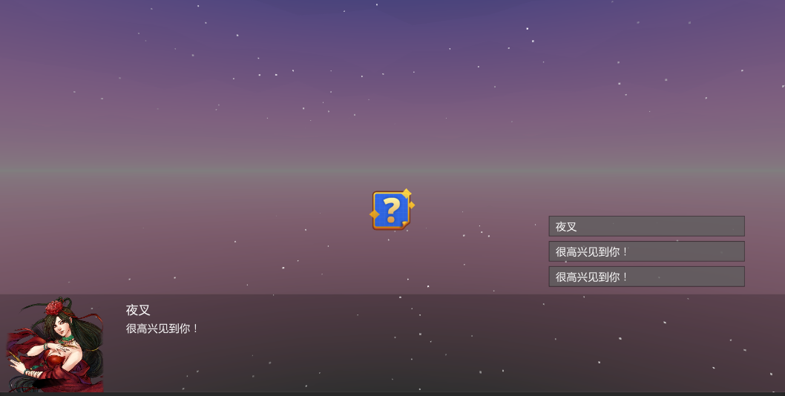

# Unity-GraphView-Editor

本项目使用UnityEditor.UIElements开发，源码参考Unity的ShaderGraph实现，用于实现对话编辑器，当前仅提供编辑器侧。

## 项目特点
- 原生UIElements
- 节点化
- 全局变量可拖拽
- Json/Guid
- 可扩展
- 源生成器

## 效果预览

## 框架说明
- 视图
  - 主视图
    - 节点
      - 端口
    - 线
  - 变量面板
- 数据
  - 序列化
  - 视图数据
    - 节点数据
  - 面板数据

## 编辑器框架
- Editor（GraphWindow : EditorWindow）
  - GraphEditorView（VisualElement）
    - Toolbar
    - GraphView
      - Manipulators
      - Nodes（BaseNodeView : Node）
        - 见「节点视图」
      - Edges
      - Ports
      - ErrorBadge（IconBadge）
      - SearchWindowProvider
    - Blackboard
      - Fields
        - Drag to GraphView → PropertyNodeView
      - ContextualMenu
  - Persistence
    - GraphObject（ScriptableObject → JSON）
    - BlackboardObject（ScriptableObject → JSON）

## 节点视图

- BaseNodeView（: Node, IDisposable）
  - 公共部分
    - Ports（input / output）
    - Controls
    - Preview
    - Badges
  - ActionNodeView
    - Entry
    - Output
  - BasicNodeView
  - InputView
- PropertyNodeView

## 数据结构

- GraphObject（ScriptableObject, ISerializable）
  - GraphData
    - Nodes
      - NodeData（: IData, `[JsonDerivedType]`）
        - Position
        - PreviewExpanded
        - Slots
          - SlotData
            - Typee
            - Value
            - Connections (Guid)
            - - BlackboardObject（ScriptableObject, ISerializable）
  - BlackboardData
    - Fields
      - FieldData（: IData, `[JsonDerivedType]`）
